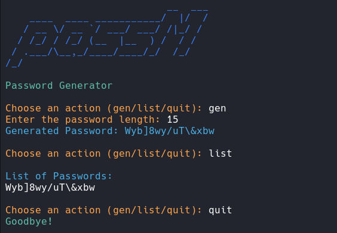

# passM

# Password Manager "passM"

## Overview

"passM" is a simple command-line password manager written in Python. It allows you to generate strong passwords, save them securely, and retrieve them when needed. Additionally, the manager provides an option to encrypt passwords for added security.

## Features

- Generate strong and random passwords of custom length.
- Save passwords securely in an encrypted format.
- List saved passwords for easy retrieval.
- Utilizes the Fernet symmetric (also known as "secret key") encryption to safeguard your passwords.

## How to Use

1. Clone the repository to your local machine.
2. Ensure you have Python installed on your system.
3. Install the required modules using the following command:
   -pip install pyfiglet termcolor cryptography-

4. Run the `passM.py` file using Python.

## Usage

- Choose "gen" to generate a new password. You'll be prompted for the desired length.
- Choose "list" to view saved passwords. You'll need to provide the password used for encryption.
- Choose "quit" to exit the program.

## Screenshots

